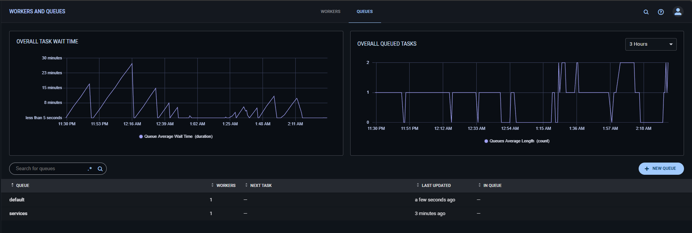

# clearml-ml-pipelines

<a target="_blank" href="https://cookiecutter-data-science.drivendata.org/">
    
</a>

A short description of the project.


Обязательно создаем 2 очереди default и services.

1. Открой ClearML UI: http://localhost:8080
2. Перейди: Workers & Queues → Queues
3. Нажми ➕ New Queue
4. Результат должен быть таким
    

5. Далее в двух разных сессиях:
    ```
    export $(grep -v '^#' .env | xargs) && clearml-agent daemon --queue default --foreground
    ```

    ```
    export $(grep -v '^#' .env | xargs) && clearml-agent daemon --queue services --foreground
    ```


# Trash
```
export PYTHONUNBUFFERED=1
clearml-agent daemon --queue default
```
or
```
export PYTHONUNBUFFERED=1
clearml-agent execute --id 1cc3a7310de049f1ba5d7f6331df7ea6
```

```
export $(grep -v '^#' .env | xargs) && clearml-agent daemon --queue default
```

```
poetry export -f requirements.txt --output requirements.txt --without-hashes
```

<!-- clearml-agent execute --id aec7f28b782a4459ac8969de3aef262b --standalone -->


rm -rf ~/.clearml/venvs-cache
rm -rf ~/.clearml/venvs-builds*

clearml-agent daemon --queue default --foreground

